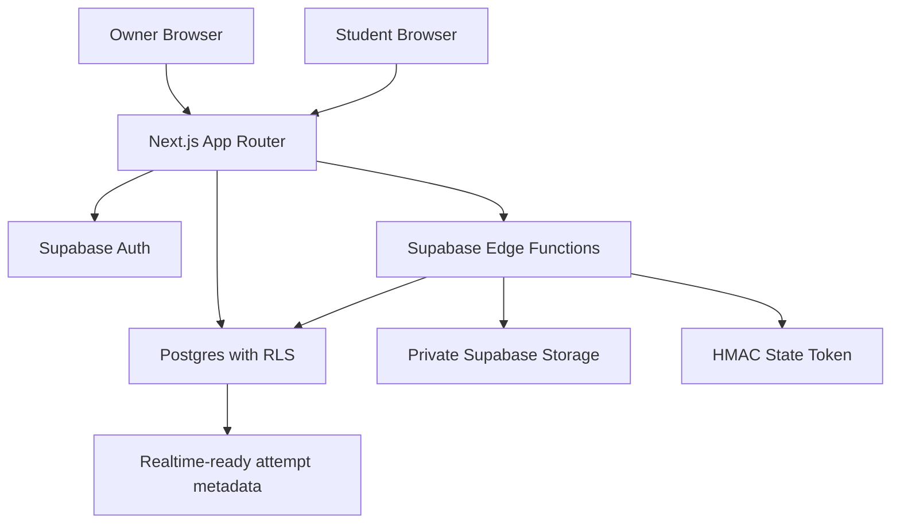
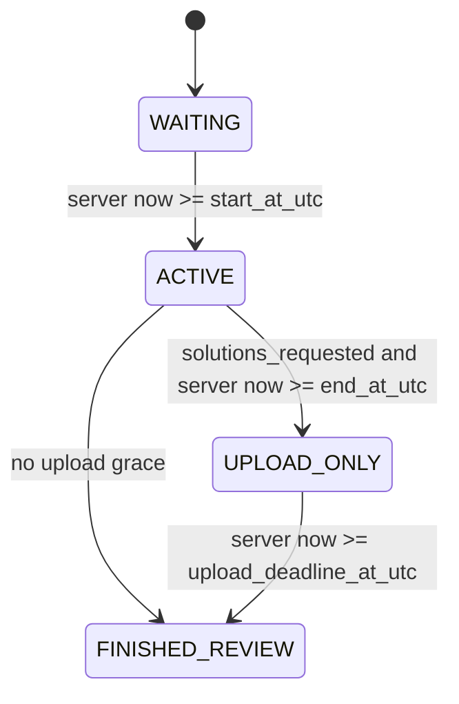

# Architecture

## State Machine

All stored times are UTC. The default display timezone is `Africa/Johannesburg`.

## Responsibilities

- Next.js renders the product shell, forms, dashboards, paper views, countdown display, and telemetry listeners.
- Supabase Auth authenticates owners and students.
- Postgres stores metadata, immutable assessment versions, attempts, responses, upload slots, and moderation reports.
- RLS protects metadata and prevents direct student reads of sensitive question/package tables.
- Edge Functions handle privileged workflows and recompute attempt state server-side.
- Private Storage stores source papers, normalized packages, answer uploads, and marking packets.

## Content Release Model

The waiting page renders metadata only. It does not request or preload the normalized package. `get-attempt-package` validates JWT ownership, recomputes state, validates a short-lived state token, and denies content during `WAITING`.

## Storage Strategy

- `assessment-sources`: original PDFs, LaTeX, and JSON imports.
- `assessment-packages`: immutable normalized packages and rendered assets.
- `answer-uploads`: one current student PDF per upload slot plus blank placeholders.
- `marking-packets`: optional owner-only generated bundles.

All buckets are private. Signed URLs are minted on demand by Edge Functions after server-side state checks.

## Edge Function List

`create-student`, `activate-student`, `ingest-assessment`, `update-question-tree`, `publish-assessment`, `get-attempt-state`, `start-attempt-session`, `get-attempt-package`, `issue-upload-slot-url`, `confirm-upload-slot`, `submit-blank-slot`, `save-text-response`, `finalize-attempt`, `record-attempt-event`, `summarize-attempt-report`, and `owner-download-marking-packet`.

