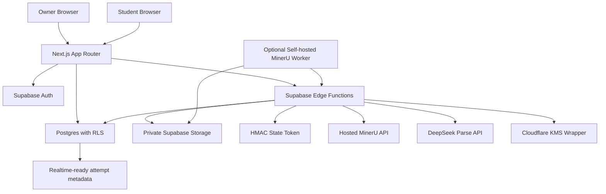
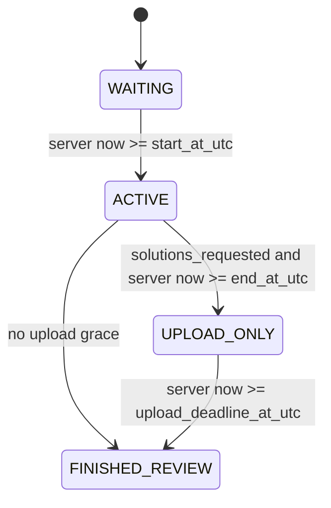

# Architecture

## State Machine

All stored times are UTC. The default display timezone is `Africa/Johannesburg`.

## Responsibilities

- Next.js renders the product shell, forms, dashboards, paper views, countdown display, and telemetry listeners.
- Supabase Auth authenticates owners and students.
- Postgres stores metadata, immutable assessment versions, attempts, responses, upload slots, and moderation reports.
- RLS protects metadata and prevents direct student reads of sensitive question/package tables.
- Edge Functions handle privileged workflows and recompute attempt state server-side.
- Private Storage stores source papers, normalized packages, answer uploads, and marking packets.
- Hosted MinerU runs through Supabase Edge Functions. Edge Functions sign or upload the private PDF, poll MinerU by
  batch id, and write draft artifacts back to private Storage for owner review.
- The self-hosted MinerU worker remains an optional fallback if hosted processing is too limited or privacy requirements
  require keeping PDFs on infrastructure you control.
- DeepSeek is used only for AI-assisted parse proposals. Zod validation and owner review remain mandatory before publish.
- The Cloudflare KMS wrapper can envelope-encrypt normalized package objects and marking packet ZIP objects before they are written to private Storage.
- SEB Secure Mode validates URL-specific Browser Exam Key and Config Key request hashes server-side for `seb_required` attempts. Browser user-agent checks are not treated as proof.
- QTI import/export maps a conservative subset of the normalized package into QTI 2.1-oriented ZIP packages.

## Content Release Model

The waiting page renders metadata only. It does not request or preload the normalized package. `get-attempt-package` validates JWT ownership, recomputes state, validates a short-lived state token, and denies content during `WAITING`.

For `delivery_mode = seb_required`, package release also requires matching BEK/CK request hashes. Classic SEB sends
official request headers to Edge Functions. Modern SEB WKWebView clients use the JavaScript API relay path, which is
accepted only with a session-bound state token and an allowlisted exam page URL. Missing, expired, or mismatched
verification fails closed.

## Storage Strategy

- `assessment-sources`: original PDFs, LaTeX, and JSON imports.
- `assessment-packages`: immutable normalized packages and rendered assets.
- `answer-uploads`: one current student PDF per upload slot plus blank placeholders.
- `marking-packets`: optional owner-only generated bundles.

All buckets are private. Signed URLs are minted on demand by Edge Functions after server-side state checks.

Answer upload slots are strict: one PDF, max 10MB, no replacement after confirmed upload or blank placeholder.

## Edge Function List

`create-student`, `activate-student`, `ingest-assessment`, `update-question-tree`, `publish-assessment`,
`get-attempt-state`, `start-attempt-session`, `get-attempt-package`, `issue-upload-slot-url`, `confirm-upload-slot`,
`submit-blank-slot`, `save-text-response`, `finalize-attempt`, `record-attempt-event`, `summarize-attempt-report`,
`create-student-group`, `complete-parse-job`, `mineru-submit-hosted-job`, `mineru-poll-hosted-job`,
`ai-parse-assessment`, `qti-import-assessment`, `qti-export-assessment`, `save-marking`, `release-feedback`,
`export-marks-csv`, and `owner-download-marking-packet`.

Sensitive owner mutations require Supabase Auth AAL2/TOTP at the Edge Function boundary.
